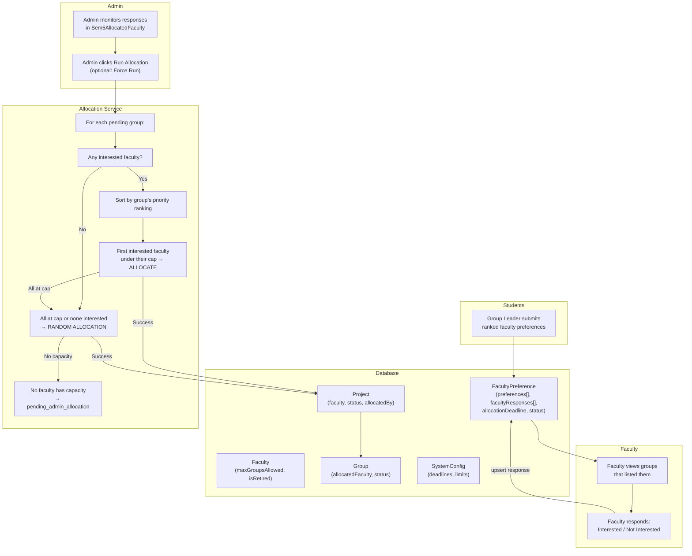
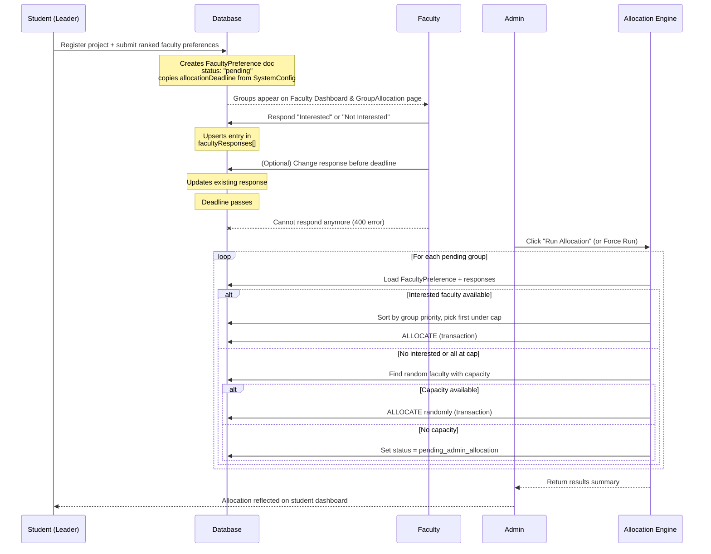

# Interest-Based Faculty Allocation System

> **Version:** 1.1  
> **Last Updated:** 2026-03-04  
> **Scope:** Semester 5 (Minor Project 2), Semester 7 (Major Project 1, Internship 1), Semester 8 (Major Project 2, Internship 2), M.Tech Sem 1, M.Tech Sem 3 — all project types that use interest-based faculty allocation.

### Semester Coverage

| Semester | Project Type | Group/Solo | Allocation Needed? | Deadline Config Key |
|----------|-------------|-----------|-------------------|--------------------|
| **Sem 5** | Minor Project 2 | Group | ✅ Yes | `sem5.allocationDeadline` |
| **Sem 6** | Minor Project 3 | Inherits Sem 5 | ❌ No (same faculty) | N/A |
| **Sem 7** | Major Project 1 | Group (coursework) | ✅ Yes | `sem7.major1.allocationDeadline` |
| **Sem 7** | Internship 1 | Solo (internship) | ✅ Yes | `sem7.internship1.allocationDeadline` |
| **Sem 8** | Major Project 2 | Group (Type 1) or Solo (Type 2) | ✅ Yes | `sem8.major2.allocationDeadline` |
| **Sem 8** | Internship 2 | Solo | ✅ Yes | `sem8.internship2.allocationDeadline` |
| **MTech 1** | Thesis / Research | Solo | ✅ Yes | `mtech.sem1.allocationDeadline` |
| **MTech 3** | Major Project 1 | Solo | ✅ Yes | `mtech.sem3.allocationDeadline` |

---

## Table of Contents

1. [Overview](#overview)
2. [Architecture](#architecture)
3. [Database Models](#database-models)
4. [Backend Services](#backend-services)
5. [API Endpoints](#api-endpoints)
6. [Frontend Components](#frontend-components)
7. [System Configuration](#system-configuration)
8. [Complete Workflow](#complete-workflow)
9. [Edge Cases & Error Handling](#edge-cases--error-handling)
10. [File Reference](#file-reference)

---

## Overview

### What It Does

The Interest-Based Faculty Allocation System allows student groups to submit a **ranked list of preferred faculty members** for their project. Each listed faculty member can then **respond with "Interested" or "Not Interested"**. After a configurable deadline, the admin runs the allocation engine, which uses the **Gale-Shapley stable matching algorithm** to optimally assign faculty to groups based on mutual preferences.

### Key Principles

- **Student Choice First:** Students rank faculty in order of preference (priority 1 = most wanted).
- **Faculty Preferences (Explicit & Implicit):** Faculty explicitly rank groups they are interested in (using the Groups UI). Unranked groups are ordered chronologically by when the faculty marked "Interested".
- **Capacity Limits:** Each faculty has a `maxGroupsAllowed` cap (default: 5). The engine never exceeds this.
- **Reversible Before Deadline:** Faculty can change their response as many times as they want before the deadline.
- **Locked After Deadline:** Once the response deadline passes, faculty can no longer modify their response.
- **Retroactive Deadlines:** If an Admin changes the allocation deadline for a semester in the System Configuration, the new deadline is automatically applied retroactively to all existing *pending* groups for that semester. No group gets stuck with an outdated deadline.
- **Fallback to Random:** If no interested faculty is available (or all are at capacity), the engine assigns a random faculty with remaining capacity.

---

## Architecture



---

## Database Models

### `FacultyPreference` Model

> **File:** `backend/models/FacultyPreference.js`

This is the **central document** for the entire allocation workflow. One document is created per group when the leader registers a project and submits faculty preferences.

#### Schema Fields

| Field | Type | Description |
|---|---|---|
| `student` | `ObjectId → Student` | The group leader who submitted preferences |
| `project` | `ObjectId → Project` | The project this preference is for |
| `group` | `ObjectId → Group` | The group this preference is for |
| `semester` | `Number (1-8)` | Academic semester |
| `academicYear` | `String` | e.g., `"2024-25"` |
| `preferences` | `Array` | Ranked faculty list (see below) |
| `facultyResponses` | `Array` | Faculty interest responses (see below) |
| `allocationDeadline` | `Date | null` | Response deadline, copied from SystemConfig at submission time |
| `status` | `String (enum)` | Current allocation status |
| `allocatedFaculty` | `ObjectId → Faculty` | The finally allocated faculty |
| `allocatedBy` | `String (enum)` | How the allocation was made |
| `allocatedAt` | `Date` | When allocation happened |
| `currentFacultyIndex` | `Number (0-9)` | Legacy: used in the old sequential choose/pass workflow |

#### `preferences` Array (Student's Ranked List)

```javascript
preferences: [{
  faculty: ObjectId,    // Reference to Faculty doc
  priority: Number,     // 1 = most preferred, 2 = second, etc.
  submittedAt: Date     // When this preference was added
}]
```

#### `facultyResponses` Array (Faculty Responses)

```javascript
facultyResponses: [{
*   `faculty`: `ObjectId('Faculty')` -> The responding faculty.
*   `response`: `Enum['interested', 'not_interested']` -> The decision.
*   `respondedAt`: `Date` -> Timestamp of the response.
*   `groupRank`: `Number` -> The explicit rank (1, 2, 3...) assigned by the faculty. Used as the primary preference indicator during stable matching. Matches without a rank fall back to `respondedAt`.ing |
|---|---|
| `pending` | Waiting for faculty responses + admin to run allocation |
| `allocated` | A faculty has been successfully assigned |
| `pending_admin_allocation` | No faculty with capacity was found — requires admin manual action |
| `rejected` | Legacy: preference was rejected |
| `cancelled` | Preference was cancelled |

#### `allocatedBy` Enum Values

| Value | Meaning |
|---|---|
| `stable_matching` | Allocated via the Gale-Shapley stable matching algorithm |
| `faculty_interest` | Legacy: allocated by sequential FCFS matching (deprecated) |
| `random_allocation` | No interested faculty available or all at capacity — randomly assigned |
| `admin_allocation` | Manually allocated by admin |
| `faculty_choice` | Legacy: old choose/pass system |

---

### `Faculty` Model

> **File:** `backend/models/Faculty.js`

#### Key Fields for Allocation

| Field | Type | Default | Description |
|---|---|---|---|
| `maxGroupsAllowed` | `Number` | `5` | Maximum active projects this faculty can supervise simultaneously |
| `isRetired` | `Boolean` | `false` | If true, this faculty is excluded from allocation |
| `mode` | `String` | `"Regular"` | Faculty type: `Regular`, `Adjunct`, or `On Lien` |
| `department` | `String` | — | `CSE`, `ECE`, or `ASH` |

---

### `Project` Model

> **File:** `backend/models/Project.js`

#### Key Fields Updated During Allocation

| Field | Changed To | Description |
|---|---|---|
| `faculty` | `facultyId` | The assigned faculty |
| `status` | `"faculty_allocated"` | Marks the project as having a faculty |
| `allocatedBy` | `"stable_matching"`, `"random_allocation"`, or `"admin_allocation"` | How the faculty was assigned |

---

### `Group` Model

> **File:** `backend/models/Group.js`

#### Key Fields Updated During Allocation

| Field | Changed To | Description |
|---|---|---|
| `allocatedFaculty` | `facultyId` | The assigned faculty |
| `status` | `"locked"` | Group is finalized and locked after allocation |

---

### `SystemConfig` Model

> **File:** `backend/models/SystemConfig.js`

Stores admin-configurable values used by the allocation system.

| Config Key | Type | Description |
|---|---|---|
| `sem5.allocationDeadline` | `Date` | Faculty response deadline for Sem 5 |
| `sem5.facultyPreferenceLimit` | `Number` | How many faculty a group must select |
| `sem5.minor2.allowedFacultyTypes` | `Array` | Which faculty types can be randomly assigned (e.g., `["Regular", "Adjunct"]`) |

Similar keys exist for `sem7.major1`, `sem8.major2`, `mtech.sem3`, etc.

---

## Backend Services

### Stable Matching Service

> **File:** `backend/services/stableMatchingService.js`

A **pure function** with zero database access. Implements the **Hospital-Resident variant of the Gale-Shapley algorithm** (many-to-one stable matching). This makes it easy to unit test and reuse across all semesters.

#### `stableMatch({ groups, faculty })`

**Input:**
- `groups` — `{ groupId: { preferences: [facultyId, ...] } }` — group's ranked faculty preferences (index 0 = most preferred)
- `faculty` — `{ facultyId: { capacity: Number, preferences: [groupId, ...] } }` — faculty's preference over groups they marked "interested" in, ordered by `respondedAt` timestamp (earlier = higher preference)

**Output:**
- `matches` — `[{ groupId, facultyId }, ...]` — stable group–faculty pairs
- `unmatched` — `[groupId, ...]` — groups that couldn't be matched to any interested faculty with capacity

**Algorithm (Hospital-Resident Gale-Shapley):**

```
1. All groups start as "free" (unmatched)
2. WHILE any free group still has untried faculty on their preference list:
   a. Group proposes to their highest-ranked untried faculty
   b. IF faculty didn't mark "interested" in this group → REJECT, group tries next
   c. IF faculty has open capacity → tentatively ACCEPT
   d. IF faculty is full but PREFERS this group over their worst current match:
      - SWAP: reject worst held group (it becomes free), accept new group
   e. ELSE → REJECT, group tries next
3. Return all matches. Groups with no match go to unmatched[]
```

**Stability guarantee:** The result is *stable* — there is no group–faculty pair where both would prefer each other over their current assignment.

#### 2. Building Faculty Preferences (`facultyInterestedGroups`)
Next, it builds the preference map for faculty. It looks at the `facultyResponses` array in the preferences.
*   It only considers responses marked as `'interested'`.
*   It orders the groups they are interested in by:
    1.  **Explict Rank (`groupRank`)**: If a faculty explicitly ranked their responses (1, 2, 3...) using the Groups UI, those ranks are respected first.
    2.  **Implicit Rank (`respondedAt`)**: If `groupRank` is null (they simply clicked "Interested" without ranking them), the earliest timestamp wins.
*   This ordered list is passed as the input for the faculty side.

---

### Allocation Service

> **File:** `backend/services/allocationService.js`

Orchestrates the allocation pipeline: loads data from DB, builds input for the pure matching algorithm, finalizes results.

#### `runAllocationForGroups(preferenceIds)` — Batch Allocation

Entry point for batch allocation ("Run Batch Allocation" button). Uses stable matching.

```
1. LOAD all FacultyPreference docs by IDs (with populated faculty, project, group data)
2. FILTER: Skip already-allocated, cancelled, or project-with-faculty groups → add to skipped[]
3. BUILD capacity map: for each referenced faculty, count their active projects vs maxGroupsAllowed
4. BUILD group preferences: ordered list of faculty IDs by group's priority ranking
5. BUILD faculty preferences: for each faculty, list groups they marked "interested" in,
   ordered by respondedAt timestamp (earlier = higher preference)
6. RUN stableMatch({ groups, faculty }) → { matches, unmatched }
7. For each match: call finalizeAllocation(pref, facultyId, 'stable_matching', results)
8. For each unmatched: call assignRandomFaculty(pref, results)
Return { allocated, randomAllocated, skipped, errors }
```

#### `allocateSingleGroup(prefId, results)` — Individual Allocation

Used when admin selects specific groups. Uses sequential best-available logic:

```
1. Load FacultyPreference with populated faculty data
2. GUARD: Skip if status is not 'pending' or 'pending_admin_allocation'
3. GUARD: Skip if project already has faculty assigned
4. Get all 'interested' responses from facultyResponses[]
5. If NO interested faculty → go to random allocation
6. Sort interested faculty by the GROUP'S priority ranking (ascending)
7. For each interested faculty (highest priority first):
   a. GUARD: Skip if faculty is null (deleted) or isRetired
   b. Count their active projects (status: faculty_allocated or active)
   c. If activeCount < maxGroupsAllowed → ALLOCATE and return
8. If all interested faculty are at cap → go to random allocation
```

#### `assignRandomFaculty(preference, results)`

Fallback when no interested faculty is available or all are at capacity:

```
1. Read allowed faculty types from SystemConfig
2. Find all non-retired faculty of those types
3. Filter to those with remaining capacity
4. If none have capacity → set status to 'pending_admin_allocation'
5. Otherwise → pick one at random and ALLOCATE
```

#### `finalizeAllocation(preference, facultyId, method, results)`

Runs in an **atomic MongoDB transaction** to ensure consistency:

```
BEGIN TRANSACTION
  1. Group.allocatedFaculty = facultyId, status = 'locked'
  2. Project.faculty = facultyId, status = 'faculty_allocated', allocatedBy = method
  3. For each group member: Student.currentProjects[].status = 'active'
  4. FacultyPreference.status = 'allocated', allocatedFaculty = facultyId, allocatedBy = method
COMMIT
(On failure → ROLLBACK all changes)
```

---

### Why Stable Matching?

The previous algorithm processed groups **sequentially by DB insertion order** (first-come-first-served). This caused unfair outcomes:

| Problem | Example |
|---|---|
| **FCFS bias** | The first group created in the DB always got its top choice, regardless of mutual preference quality |
| **Oversubscribed faculty** | If 5 groups wanted Faculty1 (cap=2), the first 2 processed "won" — the other 3 could lose even if Faculty1 preferred them |
| **No global optimization** | Each group was processed in isolation, without considering the overall assignment quality |

Gale-Shapley solves all three: it considers all groups simultaneously and produces a **stable matching** where no pair would prefer to swap.

---

## API Endpoints

### Faculty Endpoints

#### `POST /api/faculty/respond/:preferenceId`

> **Controller:** `facultyController.respondToGroup`  
> **Auth:** Faculty JWT required

Faculty responds with "interested" or "not_interested" to a group that listed them.

**Request Body:**
```json
{ "response": "interested" }
```

**Validation Checks (in order):**

| # | Check | Status | Error Message |
|---|---|---|---|
| 1 | Faculty exists | 404 | "Faculty not found" |
| 2 | Response is valid enum | 400 | "Response must be interested or not_interested" |
| 3 | Preference doc exists | 404 | "Group allocation request not found" |
| 4 | Status is `allocated` | 400 | "This group has already been allocated a faculty member." |
| 5 | Status is `pending_admin_allocation` | 400 | "This group is being handled by admin." |
| 6 | Status is not `pending` | 400 | "This group is no longer accepting responses." |
| 7 | Deadline has passed | 400 | "The response deadline has passed." |
| 8 | Faculty is in preference list | 403 | "You are not listed in this group's preferences" |

**Upsert Logic:** If the faculty has already responded, their existing response is updated (not duplicated).

---

#### `GET /api/faculty/unallocated-groups`

> **Controller:** `facultyController.getUnallocatedGroups`

Returns all groups that have listed this faculty in their preferences and are still `pending`.

**Response includes per group:**
- Group name, project title, members
- `preferences[]` — the ranked faculty list (names only)
- `myRank` — where this faculty is ranked in the group's preferences
- `myResponse` — the faculty's current response (`'interested'`, `'not_interested'`, or `null`)
- `allocationDeadline` — the response deadline
- `totalPreferences` — how many faculty the group listed

---

### Admin Endpoints

#### `POST /api/admin/run-allocation`

> **Controller:** `adminController.runAllocation`

Triggers the allocation engine.

**Request Body:**
```json
{
  "preferenceIds": ["id1", "id2"],
  "semester": 5,
  "forceRun": true
}
```

**Three Modes:**

| Mode | Condition | What Gets Processed |
|---|---|---|
| Specific IDs | `preferenceIds` array provided | Only those groups |
| Auto | No IDs, `forceRun` = false | Groups where deadline has passed |
| Force | No IDs, `forceRun` = true | ALL pending groups (ignores deadline) |

**Response:**
```json
{
  "success": true,
  "message": "Allocation complete. 2 group(s) allocated by faculty interest. 1 group(s) randomly allocated.",
  "data": {
    "allocated": [{ "prefId": "...", "facultyName": "Dr. Smith", "groupName": "Team Alpha" }],
    "randomAllocated": [{ "prefId": "...", "facultyName": "Dr. Jones", "groupName": "Team Beta" }],
    "skipped": [],
    "errors": [{ "prefId": "...", "groupName": "Team Gamma", "error": "No faculty with available capacity" }],
    "totalProcessed": 3
  }
}

---

#### `GET /api/admin/allocated-faculty?semester=X`

> **Controller:** `adminController.getSem5AllocatedFaculty` (generalized)

Fetches all groups (allocated and unallocated) for the specified semester. Used by both the Sem 5 admin page and the `AllocationRunner` component.

| Param | Type | Default | Description |
|---|---|---|---|
| `semester` | Number | `5` | Which semester to fetch groups for |
| `academicYear` | String | — | Optional academic year filter |

> **Note:** The legacy route `/api/admin/sem5/allocated-faculty` still works and defaults to semester 5.
```

---

## Frontend Components

### Faculty Side

#### `GroupAllocation.jsx` — Dedicated Allocation Page

> **File:** `frontend/src/pages/faculty/GroupAllocation.jsx`

Full-page view showing all groups that listed this faculty. Features:

| Feature | Description |
|---|---|
| **Group Cards** | Each card shows: group name, project title, members, ranked faculty preferences, and faculty's rank badge |
| **Deadline Banner** | Top banner showing when the response window closes, with color: blue (>24h), orange (<24h), red (past) |
| **Response Buttons** | "Interested" (green, check icon) and "Not Interested" (outlined red, X icon) |
| **Post-Response State** | Card border turns green/red, status banner with icon + explanatory text, "Change response" button |
| **Deadline Locked State** | When deadline passes: buttons disabled, padlock icon, "Response deadline has passed — awaiting admin allocation" |
| **Card Border Colors** | Green = interested, Red = declined, Neutral = no response yet |

#### `Dashboard.jsx` — Faculty Dashboard

> **File:** `frontend/src/pages/faculty/Dashboard.jsx`

Groups also appear on the main Dashboard with the same visual system:

| Feature | Description |
|---|---|
| **Deadline Display** | Each card shows deadline countdown with urgency colors |
| **Same 3-State UI** | Active buttons → responded state → deadline locked |
| **Color-coded cards** | Green border/tint for interested, red for declined |

### Admin Side

#### `AllocationRunner.jsx` — Modular Allocation Component

> **File:** `frontend/src/components/admin/AllocationRunner.jsx`

A **self-contained, reusable** React component for running faculty allocation on any semester. Drop it into any admin page with one line:

```jsx
<AllocationRunner semester={7} onAllocationComplete={loadData} />
```

| Feature | Description |
|---|---|
| **Group Table** | Shows all unallocated groups with checkboxes for selection |
| **Compact Response Summary** | Colored dots for interested/declined/no-response counts |
| **Expandable Popover** | Click to see detailed faculty preferences with priority rankings |
| **Batch Allocation** | "Run Batch Allocation" button for all pending groups |
| **Targeted Allocation** | Select specific groups → "Allocate Selected" button |
| **Force Run** | Checkbox to bypass deadline check |
| **Results Display** | Summary stats + detailed lists of allocated/random/errors |
| **Self-contained State** | Fetches its own data, manages its own state — no parent state required |

**Currently integrated in:**
- `Sem7Review.jsx` — `<AllocationRunner semester={7} />`
- `Sem8Review.jsx` — `<AllocationRunner semester={8} />`

#### `Sem5AllocatedFaculty.jsx` — Sem 5 Allocation Dashboard

> **File:** `frontend/src/pages/admin/Sem5AllocatedFaculty.jsx`

Dedicated full-page admin dashboard for Sem 5. Has its **own inline allocation UI** (not using AllocationRunner) because it's deeply integrated with the page's table, tabs, CSV export, and remarks editing.

| Feature | Description |
|---|---|
| **Faculty Responses Column** | Compact colored summary with click-to-expand popover |
| **Group Selection** | Checkbox column with select-all for targeted allocation |
| **Run Allocation Button** | Triggers the allocation engine with semester filter |
| **Force Run Checkbox** | Bypasses deadline check — processes all pending groups |
| **Results Display** | After running: shows allocated by interest, randomly allocated, errors |
| **Auto-refresh** | Data automatically refreshes after allocation completes |

#### `ManageProjects.jsx` — Manual Allocation

> **File:** `frontend/src/pages/admin/ManageProjects.jsx`

| Feature | Description |
|---|---|
| **Allocate Faculty** | Admin can manually assign any faculty to a group |
| **Deallocate Faculty** | Admin can remove allocated faculty (even from locked groups) |

#### `SystemConfiguration.jsx` — Deadlines & Limits

> **File:** `frontend/src/pages/admin/SystemConfiguration.jsx`

| Config | Description |
|---|---|
| **Allocation Deadline** | Date picker per semester — sets the response window |
| **Faculty Preference Limit** | How many faculty a group must select |

---

## System Configuration

| Config Key | Type | Default | Purpose |
|---|---|---|---|
| `sem5.allocationDeadline` | Date | `null` | Response deadline for Sem 5 Minor Project 2 |
| `sem5.facultyPreferenceLimit` | Number | `7` | Number of faculty each group must rank |
| `sem5.minor2.allowedFacultyTypes` | Array | `["Regular", "Adjunct", "On Lien"]` | Faculty types eligible for random allocation |
| `sem7.major1.allocationDeadline` | Date | `null` | Response deadline for Sem 7 Major Project 1 |
| `sem7.internship1.allocationDeadline` | Date | `null` | Response deadline for Sem 7 Internship 1 |
| `sem8.major2.allocationDeadline` | Date | `null` | Response deadline for Sem 8 Major Project 2 |
| `sem8.internship2.allocationDeadline` | Date | `null` | Response deadline for Sem 8 Internship 2 |
| `mtech.sem1.allocationDeadline` | Date | `null` | Response deadline for M.Tech Sem 1 |
| `mtech.sem3.allocationDeadline` | Date | `null` | Response deadline for M.Tech Sem 3 |
| `mtech.sem4.allocationDeadline` | Date | `null` | Response deadline for M.Tech Sem 4 |

---

## Complete Workflow

### Step-by-Step Flow



### The Three Allocation Outcomes

| Outcome | `allocatedBy` Value | When It Happens |
|---|---|---|
| **Interest-Based** | `faculty_interest` | At least one interested faculty has capacity. Highest-priority interested faculty is chosen. |
| **Random** | `random_allocation` | No interested faculty, or all interested faculty at capacity. A random faculty with capacity is assigned. |
| **Needs Admin** | (status = `pending_admin_allocation`) | No faculty in the entire system has remaining capacity. Admin must manually fix capacity or allocate. |

---

## Deadline-Gated Allocation (Run Allocation vs Force Run)

The allocation engine is **deadline-gated by default**. When the admin clicks "Run Batch Allocation," only groups whose `allocationDeadline` has already passed are processed. This prevents accidental early allocation while faculty are still responding.

| Action | Before Deadline | After Deadline |
|---|---|---|
| **Run Batch Allocation** (default) | ❌ Blocked — returns informative message: "X group(s) are pending but their deadline has not passed yet" | ✅ Processes all eligible groups |
| **Force Run** (checkbox) | ✅ Overrides deadline — allocates all pending groups regardless | ✅ Processes all eligible groups |
| **Select specific groups** (checkboxes in table) | ✅ Always works — explicit admin choice bypasses deadline filter | ✅ Always works |

### Backend Query Logic (`runAllocation` in `adminController.js`)

```javascript
// Without Force Run — only groups past their deadline
query.allocationDeadline = { $lte: new Date(), $ne: null };

// With Force Run — all pending groups (no deadline filter)
// query has no allocationDeadline filter
```

### Admin UX Improvements (AllocationRunner)

1. **Deadline status banner** — Shows at the top of the allocation panel:
   - 🟢 Green: "Response deadline has passed — ready to run allocation"
   - 🟠 Orange (≤24h): "Only X hours remaining. Run Allocation will be available after the deadline passes."
   - 🔵 Blue (>24h): "X hours remaining. Faculty can still change their responses."

2. **Force Run description** — Checkbox with sub-text: *"Override deadline — allocate even if the response window is still open"*

3. **Informative empty-state** — When Run Allocation returns 0 groups:
   - ⚠️ **Toast notification** (amber, 6 seconds) with the backend's reason
   - ⚠️ **Inline warning banner** in the results area: "No groups were allocated" + explanation
   - Stats grid (Allocated/Random/Skipped/Errors) is hidden when nothing was processed

4. **Success feedback** — When allocation succeeds: ✅ Toast with "X group(s) allocated successfully"

---

## Edge Cases & Error Handling

### Faculty Response Edge Cases

| Scenario | Behavior |
|---|---|
| Faculty responds after deadline passes | **400:** "The response deadline has passed." |
| Faculty responds to already-allocated group | **400:** "This group has already been allocated a faculty member." |
| Faculty responds to `pending_admin_allocation` group | **400:** "This group is being handled by admin." |
| Faculty not in the group's preference list | **403:** "You are not listed in this group's preferences." |
| Faculty changes response multiple times | Allowed — upserts the existing `facultyResponses` entry |
| No deadline set (`allocationDeadline` is `null`) | Faculty can respond at any time (no deadline enforcement) |

### Allocation Engine Edge Cases

| Scenario | Behavior |
|---|---|
| Admin changes the deadline config in the middle of an allocation term | The system automatically performs a bulk update, syncing the exact new date to the `allocationDeadline` of every single **pending** group for that semester/project type. |
| Admin manually allocates a faculty who is already at their `maxGroupsAllowed` cap | A **confirmation warning** is shown displaying the faculty's current load (e.g., "5/5 groups"). Admin must explicitly click "Override Cap & Allocate" to proceed. The allocation modal also shows color-coded capacity badges (🟢 green = available, 🟡 yellow = nearly full, 🔴 red = at capacity). |
| Interested faculty was retired after responding | **Skipped** — engine checks `isRetired` before allocating |
| Faculty document was deleted after responding | **Skipped** — null-safe check on `response.faculty` |
| All interested faculty are at their `maxGroupsAllowed` cap | Falls through to **random allocation** |
| No faculty in the system has remaining capacity | Status set to `pending_admin_allocation`, added to errors |
| `maxGroupsAllowed` not set on Faculty doc | Defaults to **5** |
| Group already has faculty assigned (double-processing) | **Skipped** by the `project.faculty` guard |
| `pending_admin_allocation` groups on retry | Re-processed when admin runs allocation again (Force Run or specific IDs) |
| Transaction fails mid-allocation | Full MongoDB **rollback** — no partial state |
| Groups with null `allocationDeadline` | Not auto-processed (require Force Run or explicit ID selection) |
| Admin clicks "Run Allocation" before deadline (without Force Run) | Returns `"X group(s) are pending but their deadline has not passed yet. Use Force Run to override."` — no groups are processed |
| Admin clicks "Run Allocation" before deadline WITH Force Run | All pending groups are processed regardless of deadline |
| Admin selects specific groups and clicks "Allocate Selected" before deadline | Selected groups are always processed (explicit admin choice) |
| All preferred faculty responded "not interested" | No interest-based match possible → falls through to **random allocation**. A faculty with remaining capacity is assigned randomly. If no faculty in the system has capacity, status is set to `pending_admin_allocation`. |
| Some preferred faculty responded "not interested", others didn't respond | Non-responders are treated as not interested. Only "interested" responses count for interest-based matching. If none responded "interested," falls through to random allocation. |

### Frontend Edge Cases

| Scenario | UI Behavior |
|---|---|
| Deadline passed, no response submitted | Card shows padlock icon + "Response deadline has passed" |
| Deadline passed, response was submitted | Card shows read-only response badge + locked message |
| Deadline less than 24 hours away | Card shows orange urgency indicator |
| Backend returns 400 on response attempt | Toast error shown with specific message from backend |
| Loading state during response | Button shows "Saving..." / "Updating..." and is disabled |


### Known Bugs & Fixes (Deadline Sync)

Three chained bugs prevented the retroactive deadline sync (`updateDeadlinesForConfigChange`) from ever working. They are documented here to prevent regressions.

#### Bug 1: Duplicate `require` crash (Fixed 2026-03-04)

**File:** `backend/controllers/adminController.js`

When `updateDeadlinesForConfigChange` was first added, the `FacultyPreference` model was `require()`-ed a second time, producing:

```
SyntaxError: Identifier 'FacultyPreference' has already been declared
```

The server couldn't start, so the function never ran.

**Fix:** Removed the duplicate `require`.

---

#### Bug 2: Missing `'date'` in `configType` enum (Fixed 2026-03-04)

**File:** `backend/models/SystemConfig.js`

The `configType` enum was `['string', 'number', 'boolean', 'object', 'array']`. Deadline configs were stored with `configType: 'date'`, which Mongoose rejected on save with a `ValidationError`. The admin UI showed *"Error updating system configuration"*.

Since the `SystemConfig.save()` call in `updateSystemConfig` threw before reaching the `updateDeadlinesForConfigChange` call below it, the sync was never triggered.

**Fix:** Added `'date'` to the enum: `['string', 'number', 'boolean', 'object', 'array', 'date']`.

---

#### Bug 3: `academicYear` mismatch — silent zero-match query (Fixed 2026-03-04)

**File:** `backend/controllers/adminController.js` → `updateDeadlinesForConfigChange`

The function computed `academicYear` from the current date:

```javascript
const currentYear = new Date().getFullYear(); // 2026
const currentAcademicYear = `${currentYear}-${(currentYear+1).toString().slice(-2)}`; // "2026-27"
```

But the `FacultyPreference` records had `academicYear: '2024-25'`. The query filtered by `academicYear: '2026-27'`, matched **zero** records, and returned silently — no error, no update, no log.

**Fix:** Removed the `academicYear` filter entirely. The query now matches by `semester` + `status: 'pending'` only, which is sufficient because:
- All pending records for a given semester should receive the active deadline
- The `projectType` filter (via `.populate('project')`) already scopes updates to the correct project type
- Stale pending records from old academic years, if any exist, *should* receive the deadline to surface them for resolution

---

#### Bug 4: Frontend response double-unwrap — wrong toast shown (Fixed 2026-03-04)

**Files:** `Sem5AllocatedFaculty.jsx`, `AllocationRunner.jsx`

The frontend API layer uses `fetch` (not Axios). This means `adminAPI.runAllocation()` returns the backend body **directly**:

```javascript
// What fetch returns (via api.js handleApiResponse → response.json())
response = { success: true, message: "...", data: { allocated: [], totalProcessed: 0 } }
```

The original code did `response.data.data` (treating it like Axios where `response.data` gives the body), so `totalProcessed` was `undefined`. The condition `undefined === 0` was `false`, so the success branch always fired — showing "✅ 0 group(s) allocated successfully" instead of the warning.

**Fix:** Created a shared utility `frontend/src/utils/allocationUtils.js` with:
- `parseAllocationResponse(response)` — correctly reads `response.data` (not `response.data.data`)
- `showAllocationToast(results)` — centralized toast logic

Both `Sem5AllocatedFaculty.jsx` and `AllocationRunner.jsx` now import and use these shared functions, eliminating duplicate code and ensuring consistent behavior across all semesters.

---

## File Reference

### Backend

| File | Role |
|---|---|
| `backend/models/FacultyPreference.js` | Core data model — preferences, responses, status, deadline |
| `backend/models/Faculty.js` | Faculty model — `maxGroupsAllowed`, `isRetired` |
| `backend/services/stableMatchingService.js` | **Pure** Gale-Shapley stable matching algorithm — zero DB access, fully testable |
| `backend/services/allocationService.js` | Allocation pipeline — loads data, calls `stableMatch()`, finalizes results via `finalizeAllocation` |
| `backend/controllers/facultyController.js` | Faculty API — `respondToGroup`, `getUnallocatedGroups` |
| `backend/controllers/adminController.js` | Admin API — `runAllocation`, `getSem5AllocatedFaculty` (generalized with `?semester=X`), `deallocateFacultyFromGroup` |
| `backend/routes/adminRoutes.js` | Routes — `/allocated-faculty?semester=X` (generic), `/sem5/allocated-faculty` (legacy) |
| `backend/controllers/studentController.js` | Deadline propagation — copies `allocationDeadline` from SystemConfig when creating FacultyPreference |

### Frontend

| File | Role |
|---|---|
| `frontend/src/components/admin/AllocationRunner.jsx` | **Reusable** allocation component — drop-in for any semester page |
| `frontend/src/utils/allocationUtils.js` | **Shared** allocation response parser + toast notifications — used by all allocation UIs |
| `frontend/src/pages/faculty/GroupAllocation.jsx` | Faculty: dedicated allocation page with full response UI |
| `frontend/src/pages/faculty/Dashboard.jsx` | Faculty: dashboard with group cards and response buttons |
| `frontend/src/pages/admin/Sem5AllocatedFaculty.jsx` | Admin: Sem 5 dedicated page with inline allocation UI |
| `frontend/src/pages/admin/Sem7Review.jsx` | Admin: Sem 7 review — uses `<AllocationRunner semester={7} />` |
| `frontend/src/pages/admin/Sem8Review.jsx` | Admin: Sem 8 review — uses `<AllocationRunner semester={8} />` |
| `frontend/src/pages/admin/ManageProjects.jsx` | Admin: manual allocate/deallocate |
| `frontend/src/pages/admin/SystemConfiguration.jsx` | Admin: deadline and limit configuration |
| `frontend/src/utils/api.js` | API client — `getAllocatedFaculty(semester)` for generic endpoint |
| `frontend/src/context/Sem5Context.jsx` | React context: provides allocation data to faculty components |
